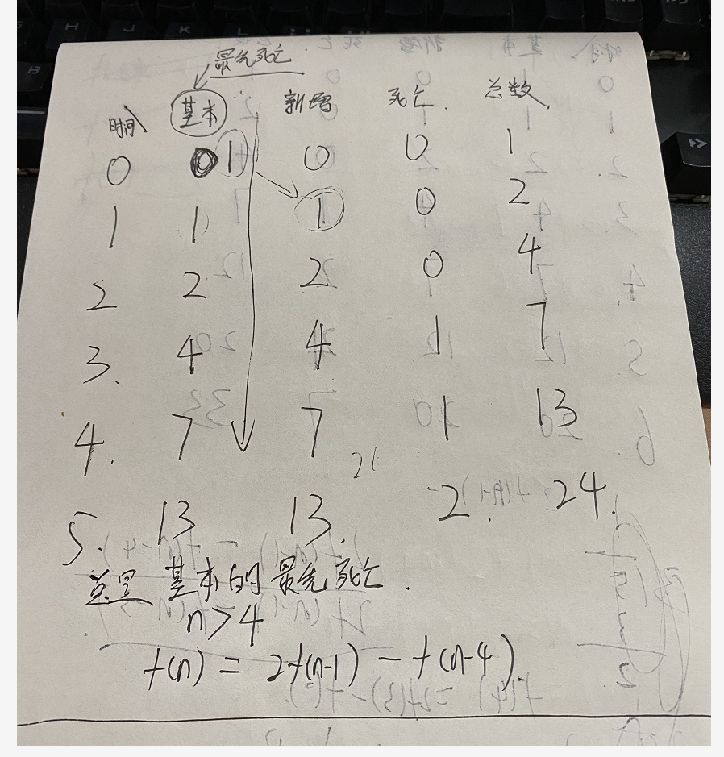
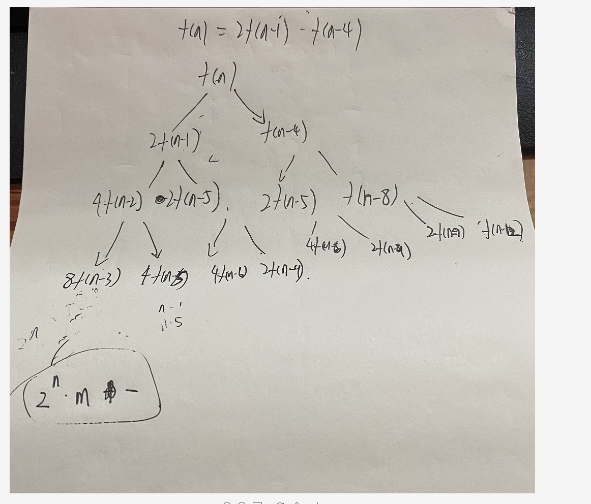

# 一个关于细胞的小问题的推导

## **首先是问题描叙:**
    1 个细胞的生命周期是 3 小时，1 小时分裂一次。求 n 小时后，容器内有多少细胞？
## **推导问题过程**

## **递归演示Code**
```
func CellBreed(n int) int {
   if n < 1 {
      return 1
   }
   if n == 1 {
      return 2
   }
   if n == 2 {
      return 4
   }
   if n == 3 {
      return 7
   }
   return 2*CellBreed(n-1) - CellBreed(n-4)
}
```

## **利用递归树来分析时间复杂度**
估测时间复杂度O(2^n)



