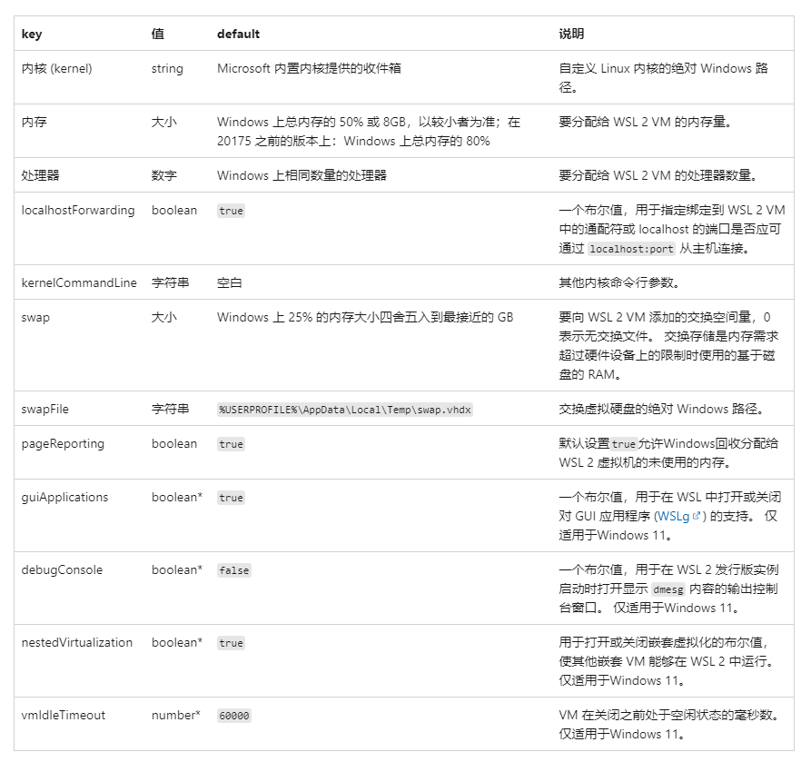
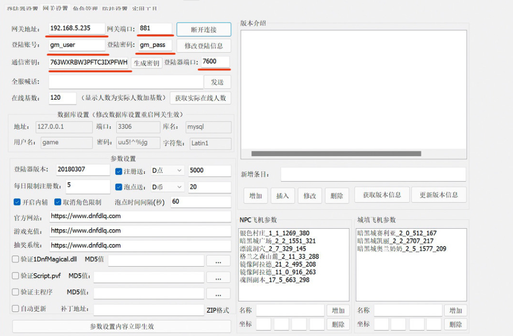
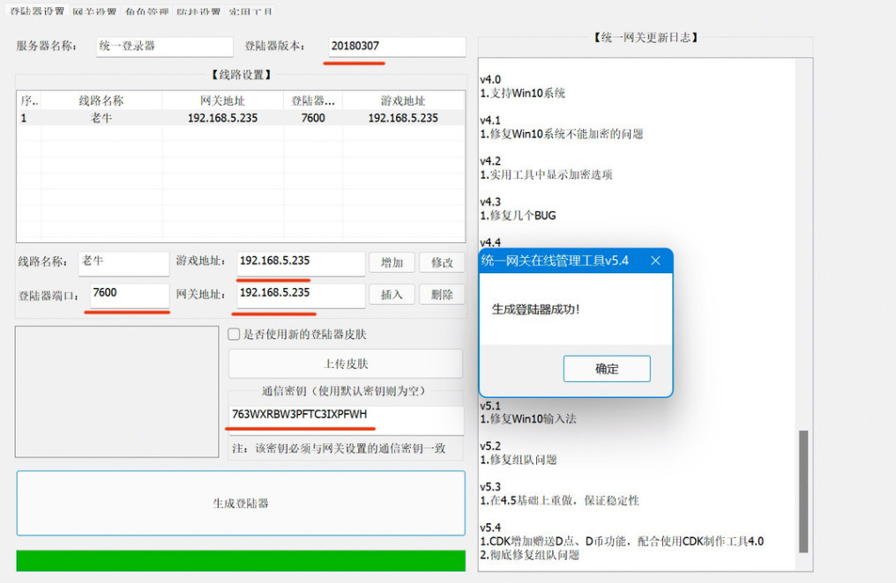

# 在win10的wsl2搭建DNF来爽一爽

## 快速搭建一个dnf私服

### 前提条件

* [在win10的wsl2固定ip](../../docs/A-bit-of-everything/wsl2-bind-ip.md)
* [DNF 台服客户端](https://pan.baidu.com/share/init?surl=0RgXFtpEhvRUm-hA98Am4A) 提取码：fybn
* [网关文件](https://pan.baidu.com/share/init?surl=dlsu7hX1bU8IeVYCVWvO5g) 提取码：2333
* [配套登录器的覆盖文件](https://pan.baidu.com/s/16txGf3LuDiLrglvQHNfLZw) 提取码：2333
* 能用[谷歌](https://www.google.com)([百度](https://www.baidu.com/)),能有点脑子

### 步骤一 设置WSL2的SWAP虚拟内存

DNF 台服容器非常消耗内存,作者推荐设置 8G SWAP 虚拟内存,所以我们这就来设置一下.如果你的机器已经大于 8G 内存,可以跳过这一步.

这里主要使用[wslconfig 的配置设置](https://docs.microsoft.com/zh-cn/windows/wsl/wsl-config#wslconf)

配置图可以参考下:



### 步骤二 创建数据库和服务端容器

* 首先创建一个文件夹用于存放数据库和日志等文件

    ```bash
    mkdir /your_path/dnf
    ```

* 把镜像拉回到本地并初始化数据库

    ```bash
    docker run --rm --privileged=true -v /your_path/dnf/log:/home/neople/game/log -v /your_path/dnf/mysql:/var/lib/mysql -v /your_path/dnf/data:/data 1995chen/dnf:stable /bin/bash /home/template/init/init.sh
    ```

    这里如果显示出这个数据库正在启动的界面就代表成功了,这里会在前台跑一个生成数据库的脚本,并不是卡住了,要耐心等大概 10 分钟就行了

    ```text
    ...省略
    Starting Mysql. SUCCESS!
    ##　大概十几分钟吧
    ...省略
    init data success
    ```

* 搭建服务器端

    ```bash
    docker run -d --name=dnf --privileged=true -e PUBLIC_IP=your_wsl2_ip -e DNF_DB_ROOT_PASSWORD=88888888 -e GM_ACCOUNT=gm_user -e GM_PASSWORD=gm_pass -v /your_path/dnf/log:/home/neople/game/log -v /your_path/dnf/mysql:/var/lib/mysql -v /your_path/dnf/data:/data -p 3000:3306/tcp -p 7600:7600/tcp -p 881:881/tcp -p 20303:20303/tcp -p 20303:20303/udp -p 20403:20403/tcp -p 20403:20403/udp -p 40403:40403/tcp -p 40403:40403/udp -p 7000:7000/tcp -p 7000:7000/udp -p 7001:7001/tcp -p 7001:7001/udp -p 7200:7200/tcp -p 7200:7200/udp -p 10011:10011/tcp -p 31100:31100/tcp -p 30303:30303/tcp -p 30303:30303/udp -p 30403:30403/tcp -p 30403:30403/udp -p 10052:10052/tcp -p 20011:20011/tcp -p 20203:20203/tcp -p 20203:20203/udp -p 30703:30703/udp -p 11011:11011/udp -p 2311-2313:2311-2313/udp -p 30503:30503/udp -p 11052:11052/udp --cpus=4 --memory=4g --memory-swap=-1 --shm-size=8g --restart always 1995chen/dnf:stable
    ```

  * **PUBLIC_IP** 等号后面填WSL2的IP
  * **-e** 参数可以自行设置数据库账号密码
  * **-v** 参数可以自行设置数据库等位置

  ```bash
  ## 查看容器是否运行
  docker ps
  ## 等待三,四分钟后可以去 /your_path/dnf/log 查看日志,返回五国就是成功
  grep -rHi 'GeoIP Allow Country Code' /your_path/dnf/log

  ```

### 步骤三 客户端设置

* 配置网关

    打开前面下载的统一网关,点到网关设置,把WSL2 ip地址填上,如果上面没有修改 docker run 参数的话,可以直接使用下述配置（IP 除外）.确保服务器防火墙放行了对应端口和所有参数都填好了以后点击一下连接.

    

  * 通讯密钥: 763WXRBW3PFTC3IXPFWH
  * 登录器端口: 7600
  * 网关端口：881
  * GM账户: gm_user
  * GM密码: gm_pass
  * 登陆器版本：20180307

  如果没有返回错误信息就代表连接网关成功,接下来就是生成启动器

* 配置登录器

    点到登录器设置,把版本号、IP 地址、密钥等参数填到对应的地方,点击增加,再点击生成,然后程序就会帮你生成一个独一无二的登陆器,把登陆器复制到 DNF 台服客户端的根目录.

    

* 配置PVF加密

    点击实用工具,依次“获取当前密码→生成随机密码→应用当前密码”,再点击打开文件,把解压文件里面的 Script.pvf 文件选上,然后点击应用,得到一个新的 Script.pvf 文件,把这个文件放回 DNF 台服客户端内即可.

    

### 总结

至此,Docker 搭建 DNF 台服是成功了, 感谢镜像作者提供了另一种搭建方法,摆脱了 CentOS 系统的束缚,其他 Linux 系统也可以用 Docker 灵活搭建.容器还有其他可自定义选项,更加详细的文档请访问作者的[Github](https://github.com/1995chen/dnf)中查看,有搭建方面的问题也可以留言或者去作者的群里面询问一下.

***虽然支持外网，但是千万别拿来开服。只能拿来学习使用!!!***

***虽然支持外网，但是千万别拿来开服。只能拿来学习使用!!!***

***虽然支持外网，但是千万别拿来开服。只能拿来学习使用!!!***
