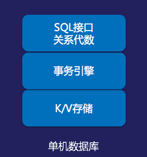

# TiDB初探

翻了一下`TiDB`的文档，对`TiDB`有了个大概的了解。简单说，`TiDB`的实现架构是：底层是分布式KV引擎`TiKV`，上层是SQL引擎`TiDB Servers`。一般传统数据库也是这么分层实现的，只不过`TiKV`实现了一个分布式、强一致、支持事务的K/V，不像数据库是单机版K/V。在TiKV之上实现SQL引擎就简化了很多，因此`TiDB Servers`是无状态的。

简化的抽象架构分层：

TiDB官方文档里的架构图：

可以看出，`TiDB`的基础工作和最突出的创新在TiKV，理论上有了这个KV，可以把单机版的SQl引擎实现方式搬过来，就有了一个可扩展的分布式数据库。

那就看看`TiKV`的架构：用`RocksDB`作为单机存储引擎，然后上层用`Raft`实现了一个分布式、强一致性的K/V。有了这个很强大的分布式K/V，在上面实现了`MVCC`层，就是对每个Key加了`version`，然后基于MVCC层最终实现了分布式事务。

* `RocksDB`内部用的是`LSM-Tree`，写入性能肯定比MySQL的`B+ tree`好。读取性能看实现的优化情况了，不过`RocksDB`是Facebook做的，应该没啥问题。

* `Raft`的实现和测试用例是从`Etcd`完全拷贝过来的，可以认为`Raft`的实现也是稳定的。 作者的原话：

> 我们做了一件比较疯狂的事情，就是我们把 Etcd 的 Raft 状态机的每一行代码，line by line 的翻译成了 Rust。而我们第一个转的就是所有 Etcd 本身的测试用例。我们写一模一样的 test ，保证这个东西我们 port 的过程是没有问题的。

* 分布式事务参照的是`Percolator`。`Percolator`和`Spanner`差不多，只不过`Spanner`引入了专有硬件原子钟，而`Percolator`依靠单点的授时服务器。两者都是对两阶段提交协议的改进。我们搞过J2EE，对两阶段提交协议应该比较熟悉，2PC的问题是：一旦事务参与者投票，它必须等待`coordinator`给出指示：提交或放弃。如果这时`coordinator`挂了，事务参与者除了等待什么也做不了。事务处于未决状态，事务的最终结果记录在`coordinator`的事务日志中，只能等它`recovery`（`HeuristicCommitException`、`HeuristicMixedException`、`HeuristicRollbackException`等异常就是遇到了这种情况，只好资源自己做了决定）。这么看在本质上，2PC为了达到一致性，实际上是退化到由`coordinator`单节点来实现`atomic commit`.

`Spanner`引入了`trueTime api`，底下存储是MVCC，每行数据都带一个时间戳做`version`，`TrueTime API`就是打时间戳的，用时间戳标识事务顺序，解决2PC依赖单点`coordinator`的问题。而依赖单点的授时服务器的问题，他们是这样解释的：

> 因为 TSO 的逻辑极其简单，只需要保证对于每一个请求返回单调递增的 id 即可，通过一些简单的优化手段（比如 pipeline）性能可以达到每秒生成百万 id 以上，同时 TSO 本身的高可用方案也非常好做，所以整个 `Percolator` 模型的分布式程度很高。

TiDB的事务隔离级别实现了`Read committed`和`Repeatable read`，没有实现最严格的`Serializable`。不过串行化的隔离级别在现实中很少使用，性能会很差。oracle 11g也没有实现它。oracle实现的是`snapshot isolation`，实际上比串行化的保证要弱。TiDB和oracle都用是`MVCC`保证了`Repeatable read`，简单说就是每个事务都读取一个一致性的`snapshot`，这个`snapshot`肯定就是完整状态。所以叫做`snapshot isolation`。按照TiDB的文档，TiDB 实现的 snapshot 隔离级别，该隔离级别不会出现`幻读`，但是会出现`写偏斜`。

`写偏斜`是什么，举个简单的例子：两个事务都先分别查询在线值班的医生总数，发现还有两个在线的医生，然后各自更新不同的记录，分别让不同的医生下线。事务提交后，两个医生都下线了，没有一个医生在线值班，出现错误的业务场景。这种异常情况是两个事务分别更新不同的记录。引起写倾斜的的模式：先查询很多列看是否满足某种条件，然后依赖查询结果写入数据并提交。解决的方法有：真正的串行化隔离级别，或者显示的锁定事务依赖的行。

从文档看，TiDB利用了成熟的开源项目，自己实现了分布式事务、分布式存储和SQL引擎，整体方案诱人，至于软件成熟程度，还需要经过实际的使用测试。

