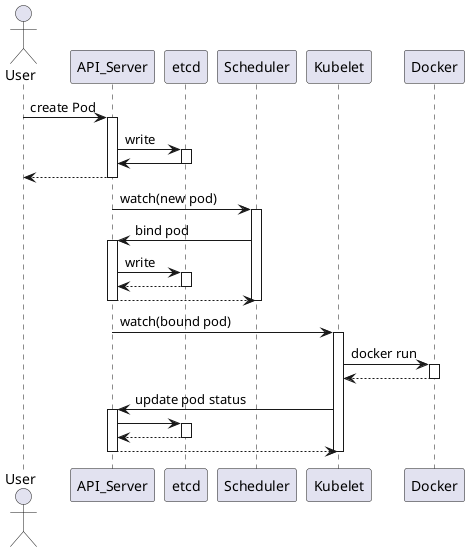

# Kubernetes调度

## 1. 创建一个Pod工作流程

* node 上的所有组件( kubelet / kube-proxy )都是与 apiserver 通信

* master 上两个组件( scheduler / controller-manager )都是与apiserver通信

* apiserver 与其他事件产生的事件,状态都保存到 etcd

* 组件与 apiserver 周期性 watch 事件

## 2. Pod中影响调度的主要属性

## 3. 资源限制对Pod调度的影响

## 4. nodeSelector & nodeAffinity

## 5. Taints & Tolerations

## 6. nodeName 

## 7. DaemonSet控制器

## 8. 调度失败原因分析
