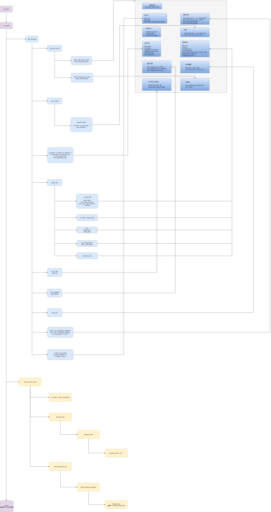
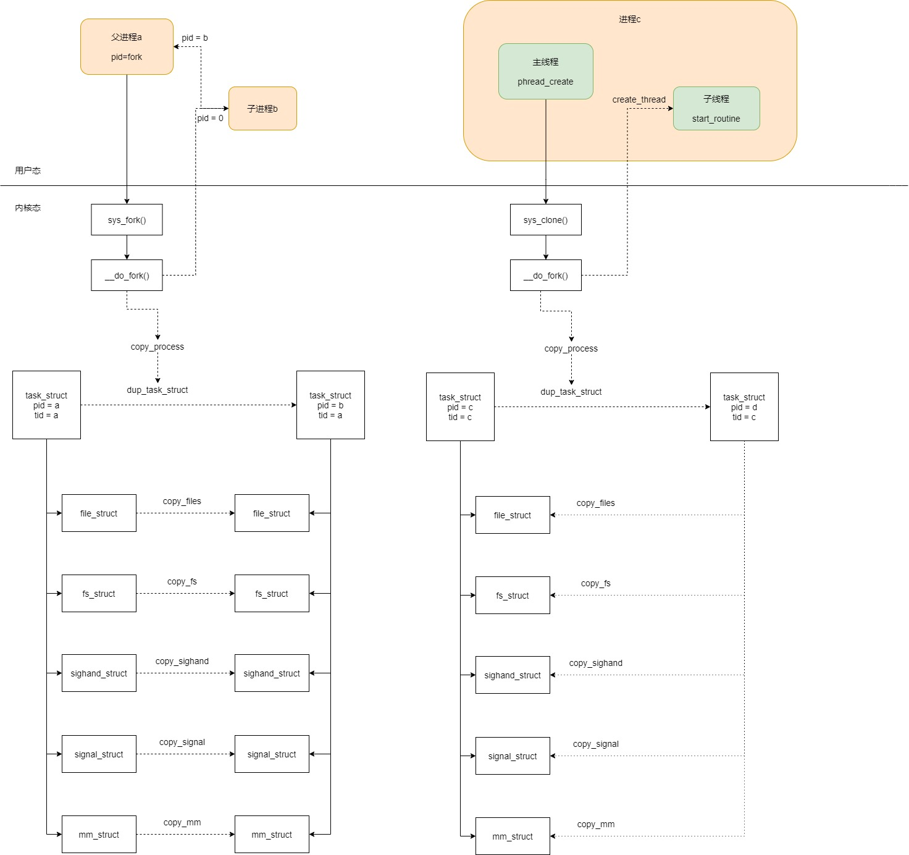

# 浅尝进程线程的创建和对应关系

## **进程**
### 进程创建的总览图

创建进程主要使用 fork 系统调用,其中包含了两个重要的事件,一个是将 task_struct 结构复制一份并且初始化，另一个是试图唤醒新创建的子进程.整个过程可以参照上图.
图的上半部分是复制 task_struct 结构,每个流程可以对照右边 task_struct 结构图.
图的下半部分是唤醒新创建的子进程,如果条件满足，就会将当前进程设置应该被调度的标识位,当前进程执行 __schedule 时候就会触发调度.

## **线程**
### 线程创建的总览图

线程的创建调用流程可以参照上图所示了,只不过和进程的创建做了对比,方便展示创建进程和创建线程在用户态和内核态的不同,加深印象.
创建进程的话,调用的系统调用是 fork，在 copy_process 函数里面,会将结构 files_struct、fs_struct、sighand_struct、signal_struct、mm_struct 都复制一遍,从此父进程和子进程各用各的数据结构.
创建线程的话,调用的是系统调用 clone，在 copy_process 函数里面,这五大结构仅仅是引用计数加一,也即线程共享进程的数据结.

