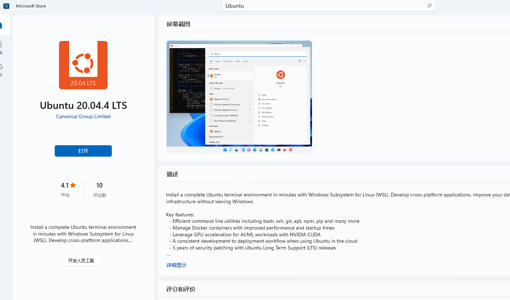
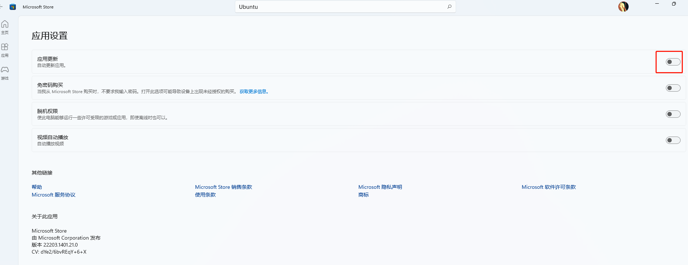
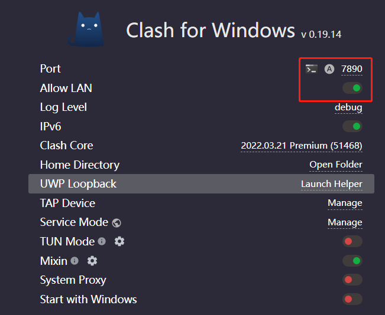

# WSL2 快速搭建开发环境

## 在Windows 10 上安装WSL2

### 前提条件

* Windows 10 版本 1903 Build 19362,或高于该版本
* 如果是ARM64的系统,则需要版本2004 Build 19041,或高于该版本

### 步骤一 安装WSL对应的Linux子系统

***根据微软WSL的文档[安装方式](https://docs.microsoft.com/zh-cn/windows/wsl/install)，可以更便捷的进行安装***

```cmd
# 查看可用发行版列表
# wsl --list --online
# 此命令将启用所需的可选组件，下载最新的 Linux 内核，将 WSL 2 设置为默认值，并安装 Linux 发行版
wsl --install -d <DistroName>
```

完成之后,以管理员身份运行 PowerShell,执行如下命令来设置wsl使用的默认版本

### 步骤二 安装其他版本Ubuntu(可选)

在开启WSL功能之后,安装一个Linux的分发版很简单,只需要打开Windows应用商店（Microsoft Store）,这里我们将安装Ubuntu 20.04分发版.打开应用商店之后,直接在应用商店中搜索 Ubuntu ,将看有很多分发版本的选项,这里选择 Ubuntu 20.04.4.



建议关闭自动升级



安装完成之后,就可以点击 启动 运行Ubuntu子系统,第一次运行需要一些时间来进行初始化配置,然后会提示输入Linux系统的用户名和密码.
这里的用户名和秘密不需要与Windows系统的用户名和密码一致,但可以通过sudo来获取管理权限.

### 步骤三 配置WSL个人使用(可选)

资源占用和设置root启动可以参考官方文档

[WSL 中的高级设置配置](https://docs.microsoft.com/zh-cn/windows/wsl/wsl-config#wslconf)

重启WSL

```cmd
# 重启 WSL 2 分发版的快速路径，但它将关闭所有正在运行的分发版
wsl --shutdown
```

### 步骤四 WSL2 配置代理(可选)

#### Windows 端

这里以 Clash 为例,打开 Allow LAN 选项,如下图所示.如果你使用其他软件,那可能是叫「网关模式」、「允许来自局域网的链接」或者其它的什么,都是一个东西,打开就好了,注意打开这个选项后你的电脑就可以代理整个局域网内的机器了,虽然其他的机器还需要额外的配置,但也还是注意安全.



Clash 这个端口 http 和 socks 通用

#### WSL2 端

说是 WSL2,其实其他的手机电脑都能连上,就在网络设置或者 WiFi 设置那有个配置代理,把上面得到的 IP 和端口填上就行.

主要操作如下

```bash
## 获取主机 IP
## 主机 IP 保存在 /etc/resolv.conf 中
## 建议写入.bashrc .profile 如果配置了zsh,建议写入 ~/.zshrc
export hostip=$(cat /etc/resolv.conf |grep -oP '(?<=nameserver\ ).*')

alias setp='export HTTPS_PROXY="http://${hostip}:7890" && export HTTP_PROXY="http://${hostip}:7890" && export ALL_PROXY="socks5://${hostip}:7890";'

alias unsetp='unset ALL_PROXY && unset HTTPS_PROXY && unset HTTP_PROXY'
```

## 配置个人的开发环境

### 配置源和短路径(可选)

备份默认源

```bash
sudo cp /etc/apt/sources.list /etc/apt/sources.list.bak
```

这里选择的是阿里的源

```text
deb http://mirrors.aliyun.com/ubuntu/ focal main restricted universe multiverse
deb-src http://mirrors.aliyun.com/ubuntu/ focal main restricted universe multiverse

deb http://mirrors.aliyun.com/ubuntu/ focal-security main restricted universe multiverse
deb-src http://mirrors.aliyun.com/ubuntu/ focal-security main restricted universe multiverse

deb http://mirrors.aliyun.com/ubuntu/ focal-updates main restricted universe multiverse
deb-src http://mirrors.aliyun.com/ubuntu/ focal-updates main restricted universe multiverse

deb http://mirrors.aliyun.com/ubuntu/ focal-proposed main restricted universe multiverse
deb-src http://mirrors.aliyun.com/ubuntu/ focal-proposed main restricted universe multiverse

deb http://mirrors.aliyun.com/ubuntu/ focal-backports main restricted universe multiverse
deb-src http://mirrors.aliyun.com/ubuntu/ focal-backports main restricted universe multiverse
```

设置短路径,首先找到 .bashrc 里这段

```text
PS1='${debian_chroot:+($debian_chroot)}\u@\h:\w\$ '
```

将小写w改为大写的W，保存退出(wq)即可,顺便介绍下一些字符含义

```text
\d ：代表日期，格式为weekday month date，例如："Mon Aug 1"

\H ：完整的主机名称。例如：我的机器名称为：fc4.linux，则这个名称就是fc4.linux

\h ：仅取主机的第一个名字，如上例，则为fc4，.linux则被省略

\t ：显示时间为24小时格式，如：HH：MM：SS

\T ：显示时间为12小时格式

\A ：显示时间为24小时格式：HH：MM

\u ：当前用户的账号名称

\v ：BASH的版本信息

\w ：完整的工作目录名称。家目录会以 ~代替

\W ：利用basename取得工作目录名称，所以只会列出最后一个目录

\# ：下达的第几个命令

\$ ：提示字符，如果是root时，提示符为：# ，普通用户则为：
```

### 配置ssh配置

```bash
ssh-keygen -t rsa -b 4096 -C "xxxxxx@example.com"
```

### 配置git

```bash
git config --global user.name "Xxx Xxx"
git config --global user.email "xxxxxx@example.com"
git config --global core.editor "vim"
```

### 配置 Shell（安装 zsh 和 oh-my-zsh）

```bash
# 安装 zsh
apt-get -y install zsh

# 将 zsh 设置为系统默认 shell
sudo chsh -s /bin/zsh
```

zsh 的配置太复杂， oh-my-zsh 可以让我们更方便的配置 zsh,重启 Terminal 生效

```bash
# 自动安装，如果你没安装 git 需要先安装 git
wget https://github.com/robbyrussell/oh-my-zsh/raw/master/tools/install.sh -O - | sh

# 或者也可以选择手动安装
git clone git://github.com/robbyrussell/oh-my-zsh.git ~/.oh-my-zsh
cp ~/.oh-my-zsh/templates/zshrc.zsh-template ~/.zshrc
```

zsh 的配置主要集中在 ~/.zshrc 文件里

```text
## 常用命令配置别名
alias cls='clear'
alias ll='ls -l'
alias la='ls -a'
alias vi='vim'
alias grep="grep --color=auto"

##  zsh的主题
ZSH_THEME="robbyrussell"
```

oh-my-zsh 还支持各种插件，存放在 ~/.oh-my-zsh/plugins 目录下

```bash
## zsh-autosuggestions：命令行命令键入时的历史命令建议插件
git clone https://github.com/zsh-users/zsh-autosuggestions ${ZSH_CUSTOM:-~/.oh-my-zsh/custom}/plugins/zsh-autosuggestions

## zsh-syntax-highlighting：命令行语法高亮插件
git clone https://github.com/zsh-users/zsh-syntax-highlighting.git ${ZSH_CUSTOM:-~/.oh-my-zsh/custom}/plugins/zsh-syntax-highlighting

## 插件安装好后需要在 ~/.zshrc 文件里配置后方可使用，配置如下
vim ~/.zshrc
## plugins=(其他插件名 zsh-autosuggestions zsh-syntax-highlighting)
```

### 配置go环境

提前下好 [go1.18.2.linux-amd64.tar.gz](https://go.dev/dl/go1.18.2.linux-amd64.tar.gz)

```bash
rm -rf /usr/local/go && tar -C /usr/local -xzf go1.18.2.linux-amd64.tar.gz
export PATH=/usr/local/go/bin:/root/go/bin:$PATH
go env -w GO111MODULE=on
go env -w  GOPROXY=https://goproxy.cn,https://mirrors.aliyun.com/goproxy/,direct
```

### 配置php环境

```bash
sudo apt-get -y install php7.4
sudo apt-get -y install php7.4-cli php7.4-json php7.4-common php7.4-mysql php7.4-zip php7.4-gd php7.4-mbstring php7.4-curl php7.4-xml php7.4-bcmath
sudo apt-get -y install composer
```
