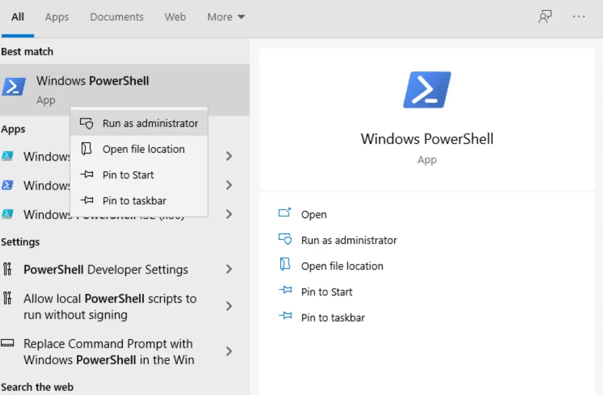
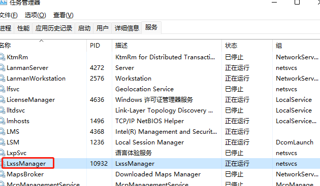

# WSL2 快速搭建开发环境

## 在Windows 10 上安装WSL2

### 前提条件

* Windows 10 版本 1903 Build 19362,或高于该版本
* 如果是ARM64的系统,则需要版本2004 Build 19041,或高于该版本

### 步骤一 为WSL启用Windows服务

想要在Windows 10上运行WSL,首先需要启用Windows上的一些务,这些服务默认是关闭的.开始菜单,搜索 PowerShell,右键 PowerShell,选择使用管理员运行

在打开的 PowerShell 终端,执行如下命令：

```cmd
# [dism.exe]是Windows的部署映像服务和管理工具
# 开启了WSL的功能
dism.exe /online /enable-feature /featurename:Microsoft-Windows-Subsystem-Linux /all /norestart
# 开启Hyper-V的功能
dism.exe /online /enable-feature /featurename:VirutalMachinePlatform /all /norestart
```

***完成以上操作之后,需要重启Windows操作系统,重启之后再次登陆系统.
接下来需要从微软下载一个最新的Linux内核升级包并安装,下载安装包 [wsl_update_x64.msi](https://wslstorestorage.blob.core.windows.net/wslblob/wsl_update_x64.msi),下载完成后直接安装.***

完成之后,以管理员身份运行 PowerShell,执行如下命令来设置wsl使用的默认版本

```cmd
wsl --set-default-version 2
```

### 步骤二 使用WSL安装Ubuntu 20.04

在开启WSL功能之后,安装一个Linux的分发版很简单,只需要打开Windows应用商店（Microsoft Store）,这里我们将安装Ubuntu 20.04分发版.打开应用商店之后,直接在应用商店中搜索 Ubuntu ,将看有很多分发版本的选项,这里选择 Ubuntu 20.04.4.


建议关闭自动升级


安装完成之后,就可以点击 启动 运行Ubuntu子系统,第一次运行需要一些时间来进行初始化配置,然后会提示输入Linux系统的用户名和密码.
这里的用户名和秘密不需要与Windows系统的用户名和密码一致,但可以通过sudo来获取管理权限.

### 步骤三 配置WSL个人使用(可选)

资源占用和设置root启动可以参考官方文档

[WSL 中的高级设置配置](https://docs.microsoft.com/zh-cn/windows/wsl/wsl-config#wslconf)

重启WSL可以使用任务管理器重启服务 LxssManager



### 步骤四 WSL2 配置代理(可选)

#### Windows 端

这里以 Clash 为例,打开 Allow LAN 选项,如下图所示.如果你使用其他软件,那可能是叫「网关模式」、「允许来自局域网的链接」或者其它的什么,都是一个东西,打开就好了,注意打开这个选项后你的电脑就可以代理整个局域网内的机器了,虽然其他的机器还需要额外的配置,但也还是注意安全.


Clash 这个端口 http 和 socks 通用

#### WSL2 端

说是 WSL2,其实其他的手机电脑都能连上,就在网络设置或者 WiFi 设置那有个配置代理,把上面得到的 IP 和端口填上就行.

主要操作如下

```bash
## 获取主机 IP
## 主机 IP 保存在 /etc/resolv.conf 中
## 建议写入.bashrc .profile
export hostip=$(cat /etc/resolv.conf |grep -oP '(?<=nameserver\ ).*')

alias setp='export HTTPS_PROXY="http://${hostip}:7890" && export HTTP_PROXY="http://${hostip}:7890" && export ALL_PROXY="socks5://${hostip}:7890";'

alias unsetp='unset ALL_PROXY && unset HTTPS_PROXY && unset HTTP_PROXY'
```

## 配置个人的开发环境

### 配置ssh配置

```bash
ssh-keygen -t rsa -b 4096 -C "xxxxxx@example.com"
```

### 配置git

```bash
git config --global user.name "Xxx Xxx"
git config --global user.email "xxxxxx@example.com"
git config --global core.editor "vim"
```

### 配置go环境

提前下好 [go1.17.8.linux-amd64.tar.gz](https://go.dev/dl/go1.17.8.linux-amd64.tar.gz)

```bash
rm -rf /usr/local/go && tar -C /usr/local -xzf go1.17.8.linux-amd64.tar.gz
export PATH=/usr/local/go/bin:$PATH
go env -w GO111MODULE=on
go env -w  GOPROXY=https://goproxy.cn,https://mirrors.aliyun.com/goproxy/,direct
```

### 配置php环境

```bash
sudo apt -y install php7.4
sudo apt-get install -y php7.4-cli php7.4-json php7.4-common php7.4-mysql php7.4-zip php7.4-gd php7.4-mbstring php7.4-curl php7.4-xml php7.4-bcmath
sudo apt install composer
```
